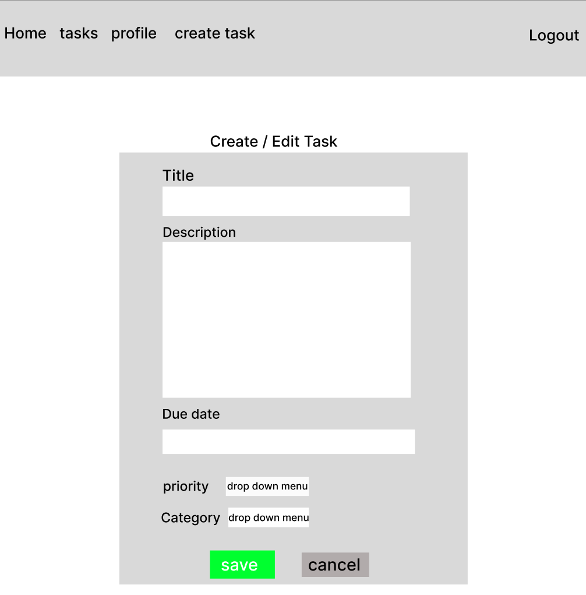
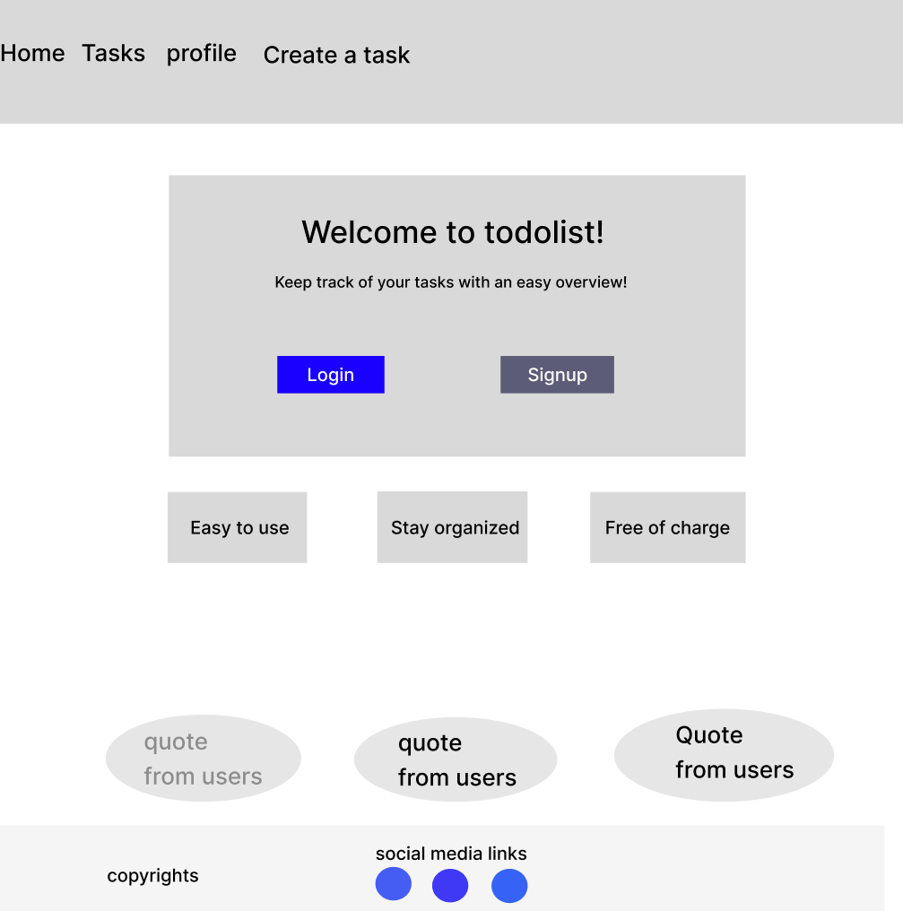

# Todo List Application


## Table of Contents
1. [Project Overview](#project-overview)
2. [Features](#features)
3. [Technologies Used](#technologies-used)
4. [Setup and Installation](#setup-and-installation)
5. [Usage](#usage)
6. [Agile Methodology](#agile-methodology)
7. [Mockups](#mockups)
8. [Data Models](#data-models)
9. [Authentication and Authorization](#authentication-and-authorization)
10. [Testing](#testing)
11. [Validation](#validation)
12. [Deployment](#deployment)
13. [Acknowledgements](#acknowledgements)


## Project Overview
The Todo List Application is a full-stack web application built using Django MVC framework. It allows users to manage their tasks efficiently by creating, editing, and deleting tasks.
The app includes user authentication, role-based access control and responsive design to ensure a seamless experience across devices.

## Features
- User authentication (signup, login, logout)
- Role-based access control (admin dashboard)
- Task management (CRUD) (Create, read, update, delete tasks)
- Profile management
- Responsive design
- Notifications for task updates

## Technologies Used
- **Programming Languages**: Python, JavaScript
- **Framework**: Django
- **Frontend**: Bootstrap, HTML, CSS, JavaScript
- **Database**: SQlite (development), PostgreSQL (production)
- **Deployment**: Heroku
- **Version Control**: Git, Github
- **IDE**: Visual Studio Code, GitHub
- **AI Assistance**: VS-Code - Copilot

### JavaScript Note
A significant portion of the JavaScript in the project comes from third-party and static files collected during the "collectstatic" process. These includes essential front-end dependencies such as Bootstrap and jQuery.

## Setup and Installation
1. **Clone the repository from GitHub**: 
git clone https://github.com/Seafzz/todo
2. Install the required packages
pip install -r requirements.txt
3. create a .env file in the project directory and add your configurations
SECRET_KEY=your_secret_key
DATABASE_URL=your_database_url
DEBUG=False
4. Run the migrations to set up your database:
python manage.py migrate
5. Create a superuser for admin access (Optional, but recommended)
python manage.py createsuperuser
6. start the development server:
python manage.py runserver
7. Your todo list should now run locally! Navigate to http://localhost:8000

## Usage
1. Navigate to http://Localhost:8000 in your webbrowser
2. Sign up for a new account or log in with your credentials.
3. Use the navigation bar to acces the task list, create new tasks and manage your profile
4. Admin users can access the admin dashboard for additional functionalities. 


## Agile Methodology
The project was planned and implemented using Agile methodology.
User stories were documented and managed using Github Project board.

 #### Project Board
  - The project board was divided into columns such as "To Do", "In Progress", and "Done" to visually track the progress of tasks. - **Example Columns**: 
  - To Do 
  - In Progress 
  - Done


The project was planned and implemented using Agile methodology. To provide a comprehensive overview, some of the issues and tasks have been documented retrospectively to reflect the actual development process.

### Mockups
Here are some of the todo List application

Here are some mockups of the Todo List Application:

### Create Task Mockup

*This mockup shows the interface for creating a new task, including fields for the task title, description, due date, priority, and category.*

### Homepage Mockup

*This mockup showcases the homepage of the application, where users can see a list of their tasks, filter tasks by category, and access other features like profile management.*


## Data Models

### User
- **Fields**:
- **username**: The unique username for the user.  
- **password**: The user's hashed password. 
- **profile**: One-to-one relationship with the Profile model.

### Profile

Stores additional information about the

- **Fields**: 
- **user**: The related user. 
- **bio**: A short biography of the user. 
- **location**: The user's location. 
- **birth_date**: The user's birth date.

### Task

Represents a task that a user can create, edit, and manage.

- **Fields**: 
- **user**: The user who owns the task. 
- **title**: The title of the task. 
- **description**: A detailed description of the task. 
- **completed**: A boolean indicating if the task is completed. 
- **due_date**: The due date for the task. 
- **created_at**: The timestamp when the task was created. 
- **priority**: The priority of the task (Low, Urgent, Asap). 
- **category**: The category of the task (Work, Personal, Others).

## Authentication and Authorization

### Authentication

User authentication ensures that only registered users can log in and access their account securely.

- **User Signup**: Users can create a new account by providing a username and password.
- **User Login**: Users can log in using their credentials to access their tasks and profile.
- **User Logout**: Users can log out to securely end their session.

### Authorization

Authorization controls what authenticated users are allowed to do within the application. Role-based access control (RBAC)
- **Standard Users**: Can create, edit, and delete their own tasks, update their profile, and view their task list.
- **Admins**: Have additional permissions, view task statistics, and access the admin dashboard.


### Security Measures
- **Password Hashing**: User password are hashed before being stored in the database


The application uses decorators such as `@login_required` and `@user_passes_test` to enforce authentication and authorization at the view level.

#### Example Code Snippets

- **Login Required Decorator**: 
```python 
@login_required def task_list(request): 
tasks = Task.objects.filter(user=request.user).order_by('due_date')
 return render(request, 'tasks/task_list.html', {'tasks': tasks}) 
 ```
- **User Passes Test Decorator for Admin Access**:
    ```python
    def is_admin(user):
        return user.is_authenticated and user.groups.filter(name='admin').exists()

    @user_passes_test(is_admin) 
    def admin_dashboard_view(request)
    total_tasks = Task.objects.count()
    completed_tasks = Task.objects.filter(completed=True).count()
    return render(request, 'admin/dashboard.html')
    ```

## Testing

### Automated Testing

Automated tests have been implemented to ensure the functionality of  the application. All tests have passed successfully. For detailed test results, refer to the [test_results.txt](test_results.txt) file.

### Manual Testing
Manual testing has been conducted to verify the functionality of the application. For detailed manual testing results and evidence, refer to the [manual_test_results.md](manual_test_results.md) file.


## Validation

- **HTML Validation**: Used the [W3C Markup Validation Service](https://validator.w3.org/) Validate HTML code.
Passed without errors.
- **CSS Validation**: Used the [W3C CSS Validation Service](https://jigsaw.w3.org/css-validator/) Validate CSS code.
<p>
    <a href="http://jigsaw.w3.org/css-validator/check/referer">
        
    </a>
</p>

### Python Code Validation
- **PEP8 Compliance**: Check python code compliance with CI Python Linter
- **Unit Tests**: All unit tests passed successfully.


## Deployment

### Deploying to Heroku

1. **Create a Heroku Account**:
if you don't already have one, [sign up for a Heroku account](https://signup.heroku.com/).

2. **Create a New Heroku App**:
- Log in to your Heroku account.
- Click on the "New" button in the top right corner and select "Create new app".
- Enter a unique app name and choose your region.
- Click "Create app".

3. **Set up Enviroment Variable**:
- Navigate to the "Settings" tab of your newly created app.
- Click on "Reveal Config Vars" in the Config Vars section.
- Add the necessary enviroment variables ('SECRET_KEY, 'DATABASE_URL' DEBUG=FALSE').

4. **Connect to Github**:
- Navigate to the "Deploy" tab.
- In the "Deployment method" section, select "Github".
- Authenticate with Github if you haven't already.
- Search for your repository and connect if to your Heroku app.

5. **Deploy the Application**:
- In the "Manual Deploy" section, select the branch you want to deploy (Main)
- Click on "Deploy Branch".

6. **Access Your Application**:
- Once the deployment is complete, you can open your application by clicking on the "Open app" button.

## Acknowledgements

- **Friends**: For their support and help with live testing.
- **Studentcare**: For giving me more time to finish this project due to unforeseen events.
- **Cloud with Django**: For inspiration and specifically CRUD functionality. [YouTube](https://www.youtube.com/watch?v=sHieKUtwQcM&ab_channel=CloudWithDjango)
- **Programming with Harry**: For inspiration and a good base to start working on this project. [YouTube](https://www.youtube.com/watch?v=bMNdcMSe3pc&ab_channel=ProgrammingWithHarry)
- **AI Assistance by Copilot**: For providing guidance and support throughout development with code bits and suggestions.


