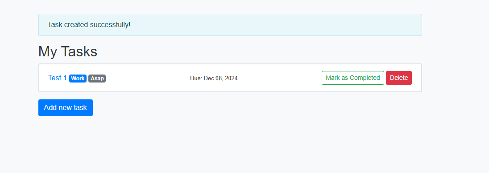
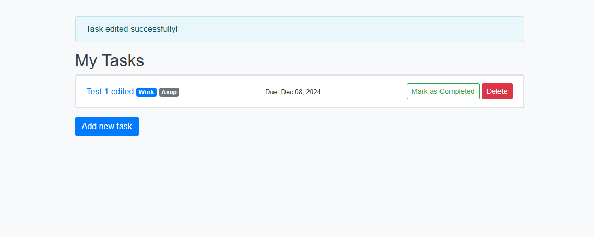
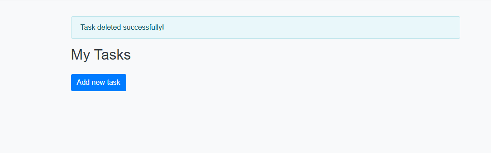
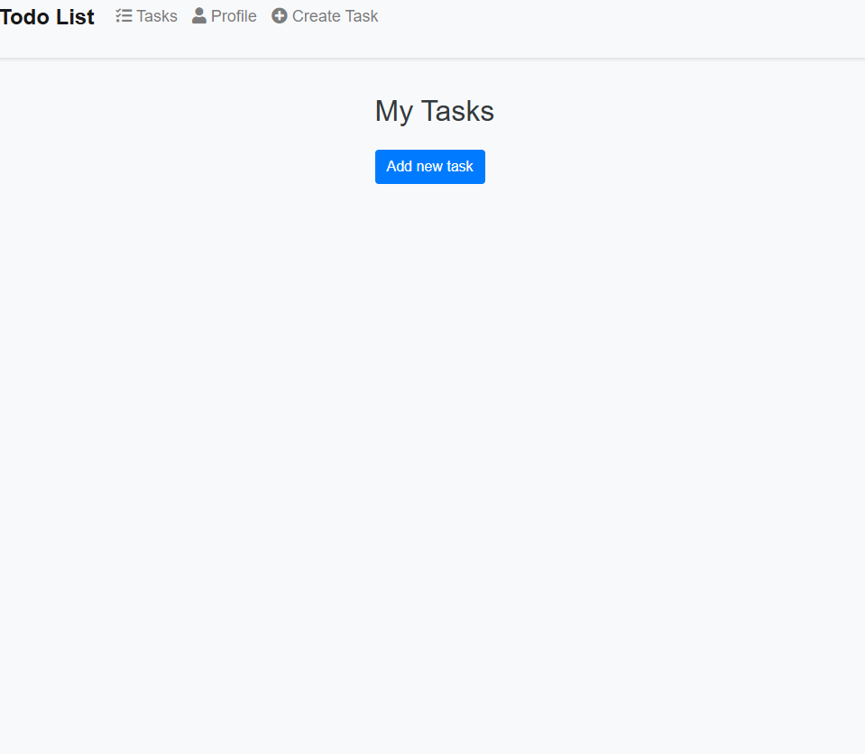
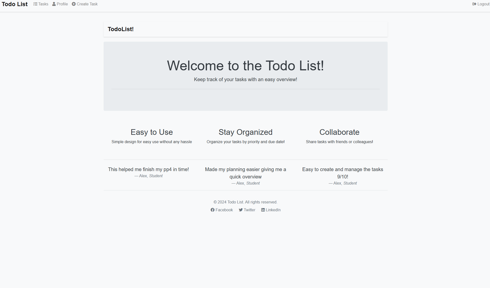
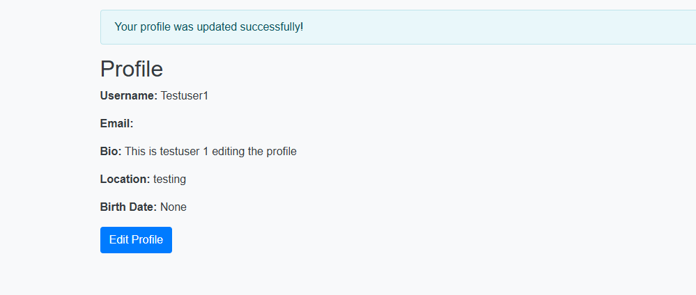
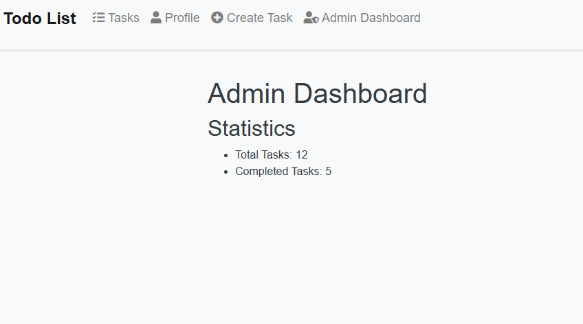
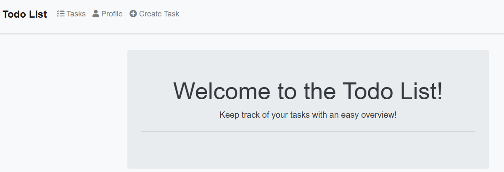
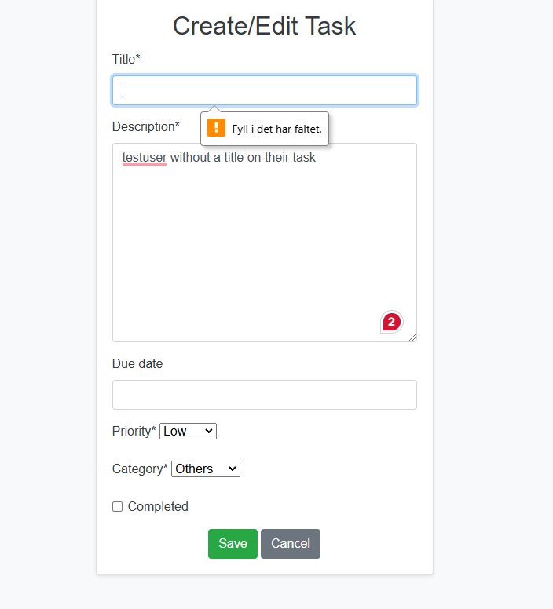

# Manual Test Results

## Test Plan

| Test Case Description                 |   Expected Result                         | Actual Result                          |
| ------------------------------------  |  ---------------------------------------  | ---------------------------------------|
| Veryify user can create a task        |  Task is created and visible in task list | Task created successfully              |
| Verify user can edit a task           |  Task details are updated                 | Task edited successfully               |
| Verify user can delete a task         |  Task deleted successfully                | Task deleted succesfully
| User can make a task as completed     |  Task will be marked complete sucessfully | Task was marked compelte successfully
| User signup                           |  User account is created and user is redirected to Tasks | User account was created succesfully and redirected to tasks
| User Login                            |  User is logged in and redirected to the homepage | User was logged in and redirected to the homepage
| Profile Update                        |  Profile Details are updated                      | Profile details was updated successfully                                      
| Admin dashboard Access                |  Admin dashboard is accesible and shows user statistic |
| Role-based Acces control              |  Normal user will neither have the possibility to see the dashboard icon or use url to acces admin.dashboard | Admin dashboard was not vissible| Normal user couldnt see the dashboard icon or use the url to get acces to the dashboard.
| Form Validation                       |  Appropriate messages are displayed. | Appropiate message was displayed, but shown in swedish during tests |

## Test Evidence

### Task Creation
- 

### Task Editing
- 

### Task Deletion
- 

### User Signup
- 

### User Login
- 

### Profile Update
- 

### Admin Dashboard Access
- 

### Role-Based Access Control
- 

### Form Validation
- 

